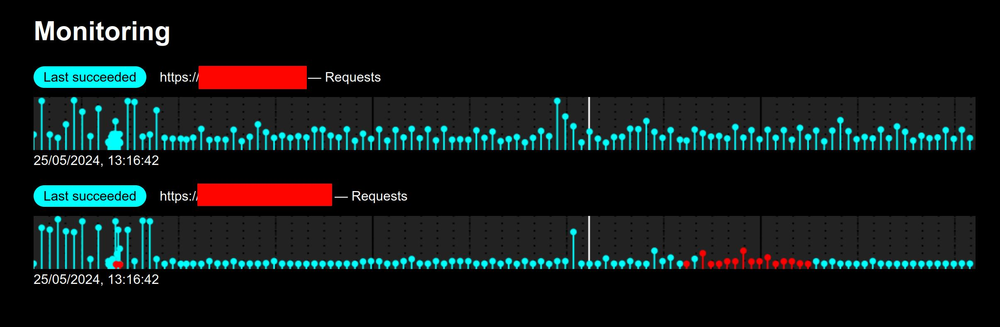

This is a simple, single python file, home network monitoring library that
I'm currently using for my home network.

# Example
As a placeholder for usage documentation, my current usage of the library
looks like this (with sensitive information replaced by "DOMAIN1", "DOMAIN2",
, "XXX.XXX.XXX.XXX" and "XXXX"):

monitor.py
```python
import sys
from typing import cast

from home_net_monitoring import *


def command_handler():
    if next_check():
        expect_response_status(200)
        request_url("https://DOMAIN1")
    if next_check():
        expect_response_status(200)
        request_url("https://DOMAIN2")


def main():
    if "--dev" in sys.argv:
        dev()
        ip("127.0.0.1")
        port(8000)
        poll_interval(5)
        run_checks_interval(30)
    else:
        ip("XXX.XXX.XXX.XXX")
        port(XXXX)
        poll_interval(60*5)
        run_checks_interval(60*30)

    notification_mechanism("sh-command")
    notification_sh_command(
        "DBUS_SESSION_BUS_ADDRESS=unix:path=/run/user/1000/bus "
        "notify-send --urgency=critical 'Home Network Failure' '<message>'")

    run_command(cast(Command, sys.argv[1]), command_handler)


if __name__ == "__main__":
    main()
```

I'm running it on a home server as service with the command
`python3 monitor.py run-service`.

Here's a screenshot of the server's monitoring page (with domain names
anonymized):


And have the crontab entry
```
* * * * * cd /home/.../home-net-monitoring && python3 monitor.py check-notification
```
on my local machine to send me notifications when "DOMAIN1" or "DOMAIN2"
are down.

The important parts of the public API have doc-strings but a holistic
overview and introduction is missing.

# Installation
Clone the git repo to a subdirectory of your code's directory and add the import
`from home_net_monitoring import ...`.

OR

Copy `__init__.py` to your code's directory and renaming the file to the name
you want to use and add the import `from <name> import ...`.

If you want this from PyPI, create an issues and I'll upload it.

# Security
The library currently uses `http.server.HTTPServer` as the server and
I have not put any effort into guarantying the reliablility of URL parsing.
Consequently, the server could very likely be made to crash by an attacker.
This means you should only ever deploy this, in its current state,
on a trusted network or a server you don't care about! For a more reliable
deployment, you should set memory and CPU limits on the process running the
server and isolate the process. Mechanism to achieve these restrictions
exist for systemd, docker and co.

If you need more reliability, create an issue to let me know and I can add
a hooking mechanism for production ready HTTP server implementations.
I'm also open to adding specialized support for headless servers with
simple APIs such as Flask and FastAPI.

